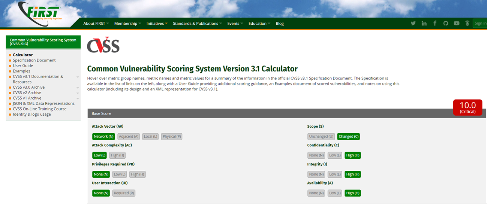

# cvss



```
漏洞有多嚴重？
https://ithelp.ithome.com.tw/articles/10203313

通用漏洞評分系統 (Common Vulnerability Scoring System, CVSS)。CVSS的研究是由
美國國家基礎建設諮詢委員會 (National Infrastructure Advisory Council, NIAC)從2003年所發起的，並在2005年2月完成第一版CVSS (CVSSv1)，
後續則轉由FIRST（不知道FIRST是什麼的朋友請看https://ithelp.ithome.com.tw/articles/10197572 ）進行進一步改善及研究發展，
FIRST也因此建立一個CVSS特別興趣群 (CVSS Special Interest Group, CVSS SIG)，負責以現行CVSS為基準，
研擬下一版本的CVSS應如何進行修正及改善。在採納各方意見後，
2007年6月第二版的CVSS (CVSSv2)正式出爐，而隨著各界持續提供許多意見，在2015年6月則發布了目前正在使用的第三版CVSS (CVSSv3.0)。
```
```
https://www.first.org/cvss/
```
```
8個面向來進行評分，並得出一個0.0～10.0分的分數，分數越高代表漏洞危險程度越高：


攻擊向量 (Attack Vector, AV)
Network (N)：由網際網路網路進行攻擊
Adjacent (A)： 由受限制的網路進行攻擊，如區域網路及藍芽等
Local (L)：在不連接網路的狀況下進行攻擊
Physical (P)：需接觸到實體機器才能進行攻擊


攻擊複雜度 (Attack Complexity, AC)
Low (L)：低，攻擊可被輕易重現
High (H)：高，須由攻擊者達成數項條件後才能成功


是否需要提權 (Privileges Required, PR)
None (N)：不需要
Low (L)：需要一般使用者權限
High (H)：需要管理者權限


是否需要使用者操作 (User Interaction, UI)
None (N)：不需要
Required (R)：需要使用者操作某些動作才能讓攻擊成功


影響範圍 (Scope, S)
Unchanged (U) ：僅影響含有漏洞的元件本身
Changed (C)：會影響到含有漏洞的元件以外的元件


機密性影響 (Confidentiality, C)
None (N)：無影響
Low (L)：攻擊者可以取得機密資料，但無法使用該資料
High (H)：攻擊者可以取得機密資料，且可以使用該資料

完整性影響(Integrity, I)
None (N) ：無影響
Low (L) ：攻擊者有部分權限以竄改某些資料，對含有漏洞之元件影響較小
High (H)：攻擊者有權限竄改所有資料，對含有漏洞之元件有嚴重影響

可用性影響 (Availability, A)
None (N)：無影響
Low (L)：可用性受到影響，導致服務或元件仍可被部分取得，或是時好時壞
High (H)：可用性受到嚴重影響，導致服務或元件完全不可被取得
```
